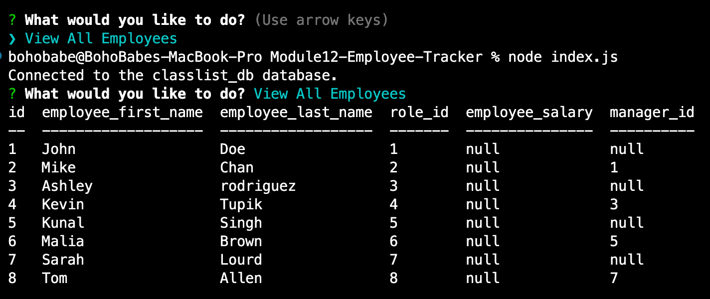

# Module12-Employee-Tracker

## Description
          
This app helps manage an employee database. The user is able to query for all employees, all roles and all departments. The user is able to easily add an employee, add a new department and add a new role. In addition the user is able to update an existing employee's role.



<br>


Check out how the employee database works though this video 
<br>
<br>


## Table of Contents

* [Installation](#installation)
* [Usage](#usage)
* [License](#license)

## Installation

Download the github repository and install node.js. Next log into your MySql shell with the command 
```
mysql -u root -p
``````
in the terminal. It should then prompt you to enter a password, enter in "password". This should start the MySql shell inside the terminal and the bash should now start with 
```
mysql>
``` 
Before the database can be used it needs to be set up, which can be done within the MySql shell. Select the database, run the schemas and seed the database with the commands below in this order:  
```
USE employee_db;
source db/schema.sql;
source db/seed.sql
```
Once those commands have been executed, check that the database is ready for use by typing this shell command, still within the MySql shell
```
SHOW TABLES;
```
If the tables department, employee and role are returned, the database is ready for use. Exit the mysql shell and run
```
node index.js
```
to start the database.

## License

For more info check [MIT License](https://opensource.org/licenses/MIT)

## Tests

You can test that the app works by selecting any of the options and viewing the results.


## Questions

For any issues, please contact me at:
slenorovitz@gmail.com
<br>
Or check out my Github page https://github.com/GypsyBoho